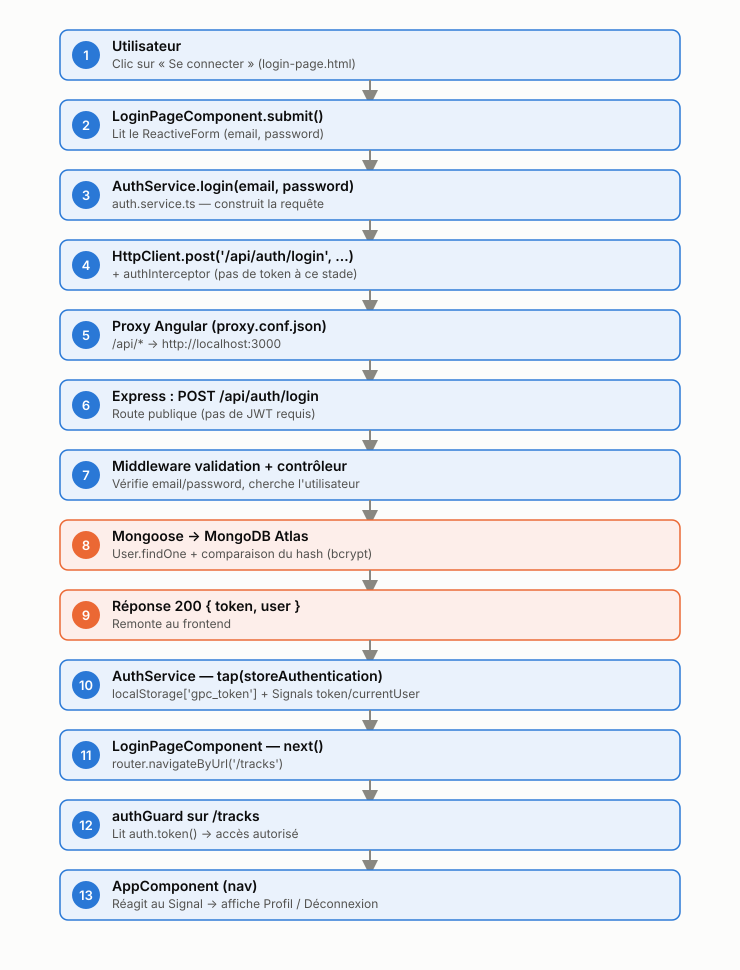

# Mission 0 — Cartographie de l'application

## Repérage dans le code

- **Composant racine** : `AppComponent` (`src/app/components/app/app.ts` + `app.html`), enregistré comme point d'entrée dans `src/main.ts` via `bootstrapApplication(AppComponent, ...)`. Il porte le `<router-outlet />` et la navigation.
- **Configuration des routes** : `src/app/routes.ts`. Cinq routes : `''` (redirige vers `tracks`), `login`, `register`, `profile` (protégée), `tracks` (protégée), et une route joker `**` qui redirige vers `tracks`. Les routes protégées utilisent `canActivate: [authGuard]`.
- **Enregistrement de `HttpClient`** : `src/main.ts`, via `provideHttpClient(withInterceptors([authInterceptor, errorInterceptor]))` dans les `providers` de `bootstrapApplication`.
- **Modèles** : `src/app/shared/models/` (`user.model.ts`, `auth-response.model.ts`, `page.model.ts`, `track.model.ts`).
- **Services** : `src/app/shared/services/` (`auth.service.ts` pour l'authentification et le profil, `track.service.ts` pour les pistes audio).
- **Pages** : `src/app/components/` (`login-page`, `register-page`, `profile-page`, `tracks-page`), chacune avec son trio `.ts` / `.html` / `.css`.
- **Mécanisme JWT** : `src/app/shared/interceptors/auth.interceptor.ts` (`authInterceptor`) lit le Signal `AuthService.token()` et, s'il existe, clone chaque requête sortante en ajoutant l'en-tête `Authorization: Bearer <token>`. En complément, `error.interceptor.ts` (`errorInterceptor`) surveille les réponses `401` sur les requêtes qui portaient ce header et déclenche une déconnexion + redirection vers `/login` si le token est invalide ou expiré.

## Routes publiques vs protégées (`API_CONTRACT.md`)

| Route | Authentification | Remarque |
|---|---|---|
| `GET /api/health` | publique | vérification de vie du backend |
| `POST /api/auth/register` | publique | crée le compte, renvoie déjà un token |
| `POST /api/auth/login` | publique | renvoie `{token, user}` |
| `GET /api/users/me` | **protégée (JWT)** | lue par `AuthService.profile()` |
| `PUT /api/users/me` | **protégée (JWT)** | appelée par `AuthService.update()` |
| `GET /api/tracks` | **protégée (JWT)** | liste paginée |
| `POST /api/tracks` | **protégée (JWT)** | upload multipart |
| `GET /api/tracks/:id/audio` | **protégée (JWT)** | flux audio |
| `DELETE /api/tracks/:id` | **protégée (JWT)** | bonus |

Seules l'inscription et la connexion se passent de JWT ; toutes les autres routes en dépendent, d'où l'intérêt de l'`authInterceptor` (ajout automatique) et de l'`errorInterceptor` (récupération propre si le token n'est plus valide).

## Schéma annoté — flux du clic sur « Se connecter »

Chemin nominal : 1 → 2 → 3 → 4 → 5 → 6 → 7 → 8 → 9 → 10 → 11 → 12 → 13
(voir les étapes numérotées dans le schéma ci-dessus).

**Chemin d'erreur** (identifiants invalides) : à l'étape 8, `User.findOne` ne trouve personne ou le mot de passe ne correspond pas → le contrôleur répond `401` (étape 9 en variante) → cette requête ne portait pas d'en-tête `Authorization` (c'est justement une connexion), donc `errorInterceptor` la laisse passer sans redirection → l'erreur remonte jusqu'au bloc `error` du `subscribe()` dans `LoginPageComponent.submit()`, qui affiche le message via le Signal `error`. Aucune redirection forcée n'a lieu ici : c'est le composant lui-même qui gère l'échec, contrairement à un token expiré sur une route déjà protégée (ex. `/api/users/me`), où `errorInterceptor` intervient parce que la requête portait bien un `Authorization`.
